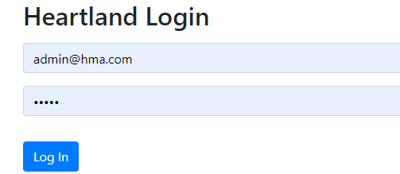
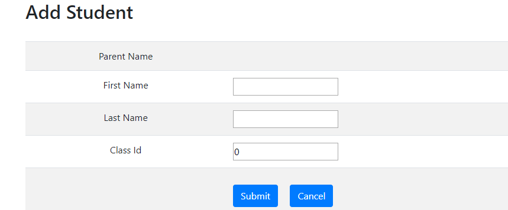
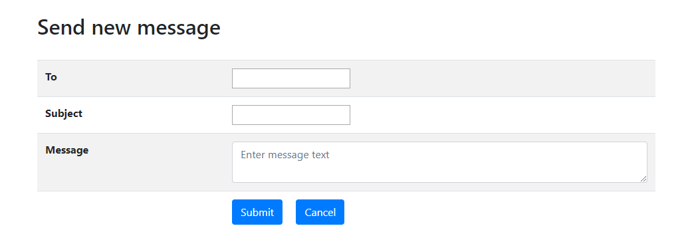

# Project Description 
This is a child care web application which is designed to provide the simplest way for the parents to be a part of their child’s daily activities and track their development.

### This application has two users:
1. Admin
2. Parent

**Admin**
- Admin can register Parent and Student
- Admin can maintain daily activity sheet of students(create/update)

**Parent**
- Registered parent can view their child's daily activity

**Sending/Receiving message**
- Both admin and parent can send message to each other 

### Screen-shots of pages:

**1. Login page**

**2. Parent registration page**

**3. Student registration page**

**4. Student List page**

**5. Student detail page**

**6. Admin view activity page**

**7. Add new activity page**

**8. Parent view activity page**

**9. Message Inbox page**

**10. Send message page**

